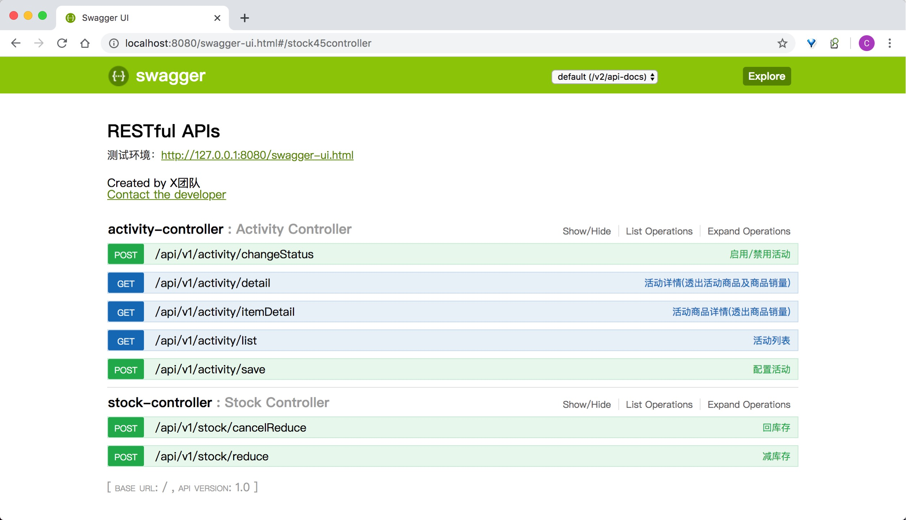

## Quick Start

### 一、设计方案

- [一个极简、高效的秒杀系统-战略设计篇](https://blog.csdn.net/caiguoxiong0101/article/details/104866073) 

- [一个极简、高效的秒杀系统-战术实践篇(内附源码)](https://blog.csdn.net/caiguoxiong0101/article/details/104866073) 

### 二、环境准备
1、启动本机redis
```shell
nohup ./redis-server &
```

2、启用本机redis-client

> 如果redis本地数据不重要，可用`flushall`命令清除全部数据, 方便多次进行测试


3、启动工程seckill-api

启动成功后, 访问`http://localhost:8080/swagger-ui.html` , 即可看到熟悉的`swagger-ui`界面 

> 如果熟悉swagger-ui使用方式, 下面的接口调试就可直接用Swagger来进行

### 三、秒杀测试

#### Step1: 配置活动

> POST `http://localhost:8080/api/v1/activity/save`

```json
{
  "activityName": "双十一秒杀第一场",
  "startTime": 1541901600000,
  "endTime": 1741951999000,
  "itemLine": [
    {
      "activityPrice": 17000,
      "itemId": 53724,
      "itemImage": "http://img.xxxx.com/static/do1_QtSq1m2xM7VL6zEI4sUH",
      "itemPrice": 42800,
      "itemTitle": "X商品标题",
      "subTitle": "X商品副标题",
      "quota": 3,
      "stock": 50
    },
    {
      "activityPrice": 4800,
      "itemId": 53725,
      "itemImage": "http://img.xxxx.com/static/MrcNjUeeoOG24zZH7nR.png",
      "itemPrice": 19800,
      "itemTitle": "Y商品标题",
      "subTitle": "Y商品副标题",
      "quota": 3,
      "stock": 50
    }
  ],
  "activityRuleConfigs": [
    {
      "configKey": "city",
      "configValue": "17,5,10,2,3,4,11"
    }
  ]
}
```


#### Step2: 启用活动

> POST `http://localhost:8080/api/v1/activity/changeStatus`

```json
{
  "activityId": 1,
  "enabled": true
}
```

#### Step3: 查看活动详情

> GET `http://localhost:8080/api/v1/activity/detail?activityId=1`


#### Step4: 扣库存
> POST `http://localhost:8080/api/v1/stock/reduce`

```json
{
  "activityAccessContext": {
    "cityId": "11",
    "storeId": "999"
  },
  "activityId": 1,
  "buyerId": "buyer_001",
  "itemId": 53724,
  "orderId": "20181111123456789",
  "orderTime": 1541901700000,
  "quantity": 1
}
```

执行完扣库存接口后, 可以调用 `http://localhost:8080/api/v1/activity/itemDetail?activityId=1&itemId=53724` 验证商品销量已变为1

#### Step5: 回库存
> POST `http://localhost:8080/api/v1/stock/cancelReduce`

```json
{
  "activityId": 1,
  "orderId": "20181111123456789"
}
```

执行完回库存接口后, 可以调用 `http://localhost:8080/api/v1/activity/itemDetail?activityId=1&itemId=53724` 验证商品销量已变为0


### 四、其他

- 在配置完活动并启用活动后，可以跑测试用例来模拟多个并发请求扣/回库存; 测试case见`com.cgx.marketing.application.activity.StockAppServiceTest`

